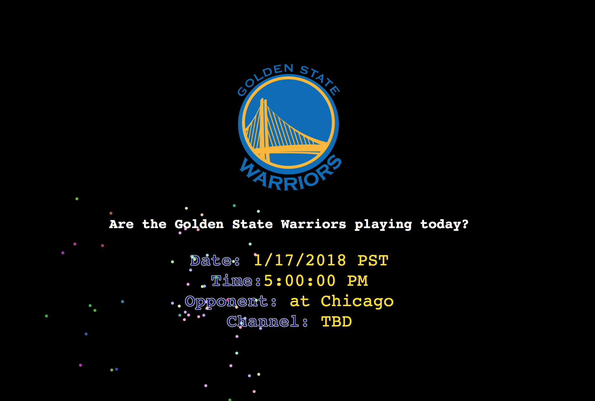

# Golden State 2.0

Do you get angry when you miss a Warriors game? I do! To solve this problem, I built an application to simply send me a text message whenever my team is playing. This is the second iteration of this project. In this version, I used server-side rendering using Express. Currently, the application is built for only my use.

To see the project in action:
```
npm run start:dev
```
and listen at ``` localhost:8080```

Tech stack: React js, Express, Firebase, Twilio, AWS Lambda function, AWS API Gateway and HTML/CSS.


